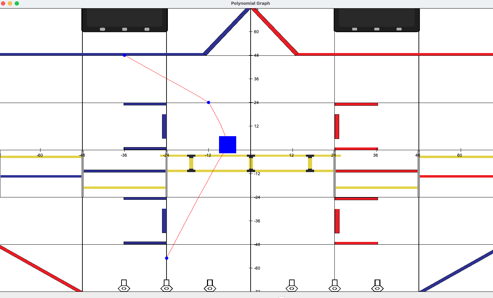

<h3>Welcome to Tarun Jaikumar's Page.</h3>

    <video src="Videos/Robotics.mp4" width="280" height="240" controls class="video-class"></video>
    

        - FTC Runtime Terror#22105 (I'm co-captain and programmer)
          
        - Made Swerve Drive
          
        - Uses kinematics/math for autonomous pathing
          
        - Made v1 of a GUI to make auto paths easier to create
    

    

<h3>Checkout my Media Links.</h3>
Subscribe to my [Youtube Chanel](https://www.youtube.com/@tarunjaikumar9058/featured) !!

Go to my [Github account](https://github.com/tarunja1ks) !!

