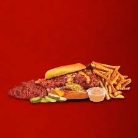
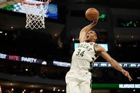

<h3>Welcome to Tarun Jaikumar's Page.</h3>

    
   

            One of my favorite restaurants is Daves Hot Chicken. I enjoy many of their menu options, including their juicy and crispy tenders, and their mouth-watering sliders. The spice level I usually get is Hot, but I can handle it with lots of Daves sauce and honey on my meal.
    

    

    
    

            My favorite sport to play is basketball, and I enjoy to play often times at my neighbhorhood park. Apart from playing basketball for fun, I love to watch nba games and see all of the cool basketball. My favorite team in the NBA is the Bucks, since they have my goat Giannis.
    

    

        thing
    

<video src="Videos/Robotics.mp4" width="320" height="240" controls></video>

