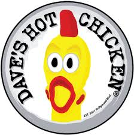

### Favorite Things to Do

    
    

        One of my favorite restaurants is Daves Hot Chicken. I enjoy many of their menu options, including their juicy and crispy tenders, and their mouth-watering sliders. The spice level I usually get is Hot, but I can handle it with lots of Daves sauce and honey on my meal.
         
    

<video src="Videos/Robotics.mp4" width="320" height="240" controls></video>

